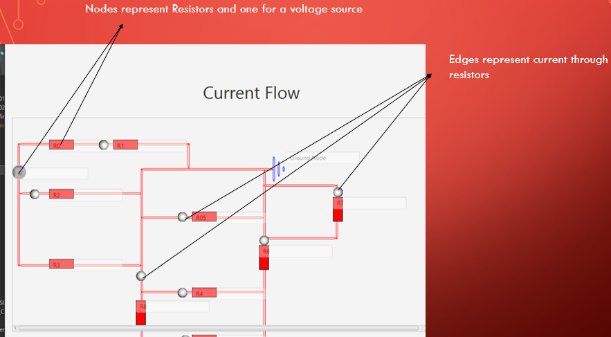

# Building Circuit using Data Structure

## Technogies used
- Java
- JavaFx
- Eclipse IDE

## The project contains the following directory structure:
- src – that contains all of the Java source files.
- dist – that contains an executable jar file

## Introduction
The current flow program deals with depicting the structure of an electric circuit and the positioning of the electric components in the circuit.
It depicts the current flow in parallel and series resistors. Thus, to distinguish between the amount of current flowing into a resistor or number of resistors
In the electrical field, students  who are oblivious of the structure and the current flow directions this program will be the source.

## Problem
The problem is having to compute the current through a specific nodal(paths), thus this also depicts current through paths.
People who are oblivious of the structure and the current flow directions of an electrical circuit this program will be the source

## Solution
- Nodes represent Resistors and one for a voltage source
- Edges represent current through resistors
- Traversals represent the path with the smallest amount of current
- This is represented thus because current moves through paths(wires in a circuit) so the provide direction to a resistor.

## How it looks

## Conclusion
In conclusion I couldn’t manage to achieve what I intended to do but most were successful and still working on it in attempt to solve the problem. 

